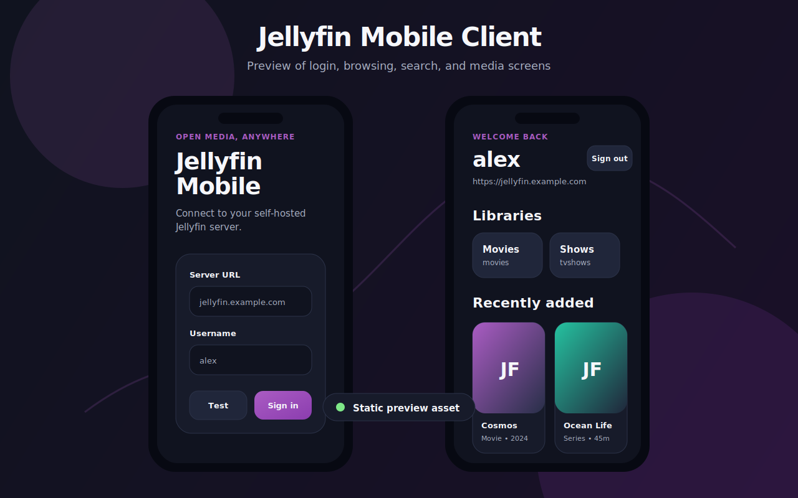

# Jellyfin Mobile Client

A lightweight Expo React Native mobile client for Jellyfin. The app signs in to a Jellyfin server, stores the active session locally, lists the user's libraries, and shows recently added media with poster art.

## Features

- Jellyfin server URL probing through `/System/Info/Public`.
- Username/password authentication through `/Users/AuthenticateByName`.
- Persisted sessions with `@react-native-async-storage/async-storage`.
- Home dashboard with user libraries, continue watching, and recently added media.
- Library browsing with selectable Jellyfin collections.
- Server-wide search across movies, shows, episodes, albums, and songs.
- Item detail sheets with overview, runtime, progress, favorite toggling, embedded MPV-style playback, and external playback links.
- Pull-to-refresh and sign-out support.
- Dark Jellyfin-inspired mobile UI.


## Core client coverage

This scaffold now covers the important pieces expected from a Jellyfin mobile client: authentication, persisted sessions, library browsing, search, resume/continue watching, recently added media, poster art, favorite management, item details, embedded MPV-style playback, and opening server stream URLs in a player registered on the device.

## Preview



## Getting started

```bash
npm install
npm start
```

Then open the app in Expo Go or an emulator and enter your Jellyfin server URL plus account credentials.

## Available scripts

- `npm start` - start the Expo development server.
- `npm run android` - open the app on Android.
- `npm run ios` - open the app on iOS.
- `npm run web` - run the web preview.
- `npm run typecheck` - run TypeScript without emitting files.


## Playback and caching

The in-app player requests Jellyfin direct streams by default (`Static=true`) to avoid server transcoding. It only shows playback actions for real audio/video items, uses the Jellyfin media source ID and source container extension when available, and reports embedded-player errors instead of trying to play library folders or series. Dependencies are pinned to Expo SDK 53-compatible React versions, the generated native app disables React Native's new architecture to avoid `expo-video` Fabric shared-object crashes on affected Android builds, and Settings gracefully disables cache controls when the installed `expo-video` build does not expose cache APIs. If a file cannot be decoded by the device, disable **Force direct video** in Settings or use **Open in external player** with an installed player such as mpv-android.

Video caching can be enabled from Settings. The app uses `expo-video` source caching for direct streams, exposes 512 MB / 1 GB / 2 GB preferred cache limits, shows current cache usage, and can clear the cache when no player is active.

## Build an APK with GitHub Actions

This repository includes a workflow at `.github/workflows/android-apk.yml` that can build a signed Android release APK directly in GitHub Actions without committing the generated `android/` folder.

### One-time setup

1. Push this repository to GitHub.
2. Open the repository in GitHub.
3. Go to **Actions**.
4. If GitHub asks, enable workflows for the repository.

### Run the APK build

1. Open **Actions** → **Build Android APK**.
2. Choose **Run workflow**.
3. Wait for the workflow to finish.
4. Open the repository **Releases** page.
5. Download `jellyfin-mobile-release.apk` directly from the latest `Jellyfin Mobile APK ...` release.

GitHub Actions artifacts are always downloaded as `.zip` archives in the GitHub UI, even when they contain a single APK. To avoid zip downloads, this workflow does not upload an Actions artifact; it publishes the built file as a raw `.apk` release asset on every successful manual run or `main` push.

### Optional Telegram delivery

To have the workflow send the APK to Telegram after it is built, create these repository secrets in **Settings** → **Secrets and variables** → **Actions**:

- `TELEGRAM_BOT_TOKEN`: the token from BotFather for your Telegram bot.
- `TELEGRAM_CHAT_ID`: the user, group, or channel chat ID that should receive the APK.
- `TELEGRAM_MESSAGE_THREAD_ID` (optional): the topic/thread ID for Telegram forum groups.

When the required Telegram secrets are set, the workflow uploads `jellyfin-mobile-release.apk` to Telegram with the Bot API `sendDocument` endpoint after publishing the GitHub Release. If either required secret is missing, the Telegram step is skipped and the APK is still available from Releases.

The workflow also runs on pushes to `main` when app source, config, or workflow files change. It intentionally uses `npm install` without setup-node npm caching and avoids setup-java Gradle caching so it can run before a `package-lock.json` or generated `android/` Gradle files exist. The APK is signed with a CI-generated throwaway keystore placed under `android/app` and passed to Gradle by absolute path, which is useful for sideloading and testing. Use a real upload/release keystore before distributing through Google Play or long-term release channels.

### Local equivalent

```bash
npm install
npm run build:android:apk
```

The local command generates a native Android project with Expo prebuild and runs Gradle's `assembleRelease` task. If you need a Play Store artifact instead of a sideloadable APK, configure EAS Build or Gradle to produce an Android App Bundle (`.aab`).

If you previously built an APK from the earlier dependency ranges, delete `node_modules` and reinstall before rebuilding so React stays pinned to `19.0.0` and matches React Native's renderer. The GitHub workflow starts from a clean checkout, so it automatically uses the pinned versions.

## Notes

The app communicates directly with your Jellyfin server. For remote access, configure HTTPS and make sure your server is reachable from the device running the app.
